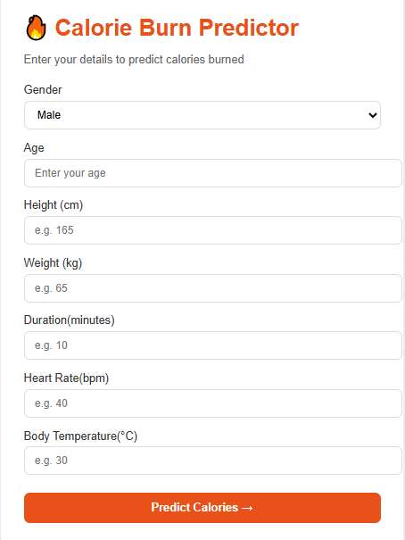
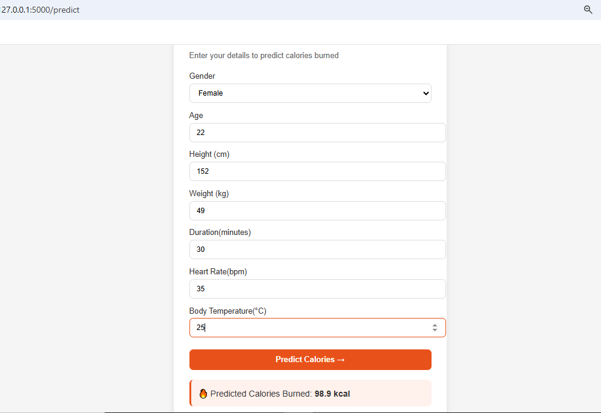
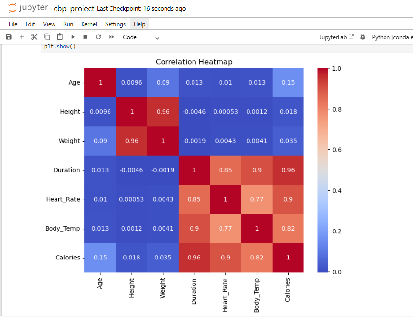

#  Calorie Burn Prediction
A machine learning web application that predicts calories burned during exercise.

## Problem Statement
Traditional calorie tracking methods are inaccurate and generalized.
This project builds a personalized ML model using real fitness data
to accurately predict calories burned during exercise.

## About
Built as part of MCA Data Science curriculum at Sri Balaji University, Pune.

## Dataset
- Source: Kaggle
- 15,000 records, 9 features
- Features: Age, Gender, Height, Weight, Duration, 
  Heart Rate, Body Temperature

## Screenshots

### Web Application

### EDA - Correlation Heatmap

## Tech Stack
- Core Programming Language: Python
- Data Analysis: Pandas, NumPy
- Visualization: Matplotlib, Seaborn
- Machine Learning: Scikit-learn (SVR, Random Forest, Decision Tree, Linear Regression)
- Web Framework: Flask
- Frontend: HTML, CSS
- Environment: Jupyter Notebook

## Project Workflow
1. Data Collection — Kaggle dataset (15,000 records)
2. EDA — Distributions, correlations, outlier detection
3. Preprocessing — IQR outlier removal, Label Encoding
4. Feature Engineering — BMI, Exercise Intensity
5. Model Building — 4 regression algorithms
6. Evaluation — MAE, MSE, RMSE, R² Score
7. Deployment — Flask web application

## Models Trained
| Model             | R² Score |
|-------------------|----------|
| Linear Regression | 0.9845   |
| Decision Tree     | 0.9920   |
| Random Forest     | 0.9979   |
| SVR               | 0.9999   |

## Key Findings
- Duration has strongest correlation with Calories (0.96)
- Heart Rate is second strongest predictor (0.90)
- SVR outperformed all models with 99.99% accuracy
- BMI and Exercise Intensity improved model performance

## How to Run
1. Install dependencies: `pip install flask scikit-learn numpy pandas`
2. Run: `python calorie_app/app.py`
3. Open: `http://127.0.0.1:5000`
